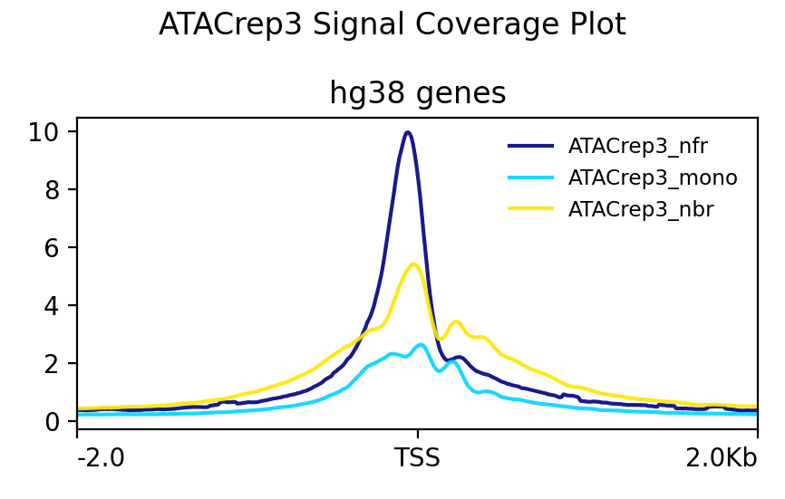
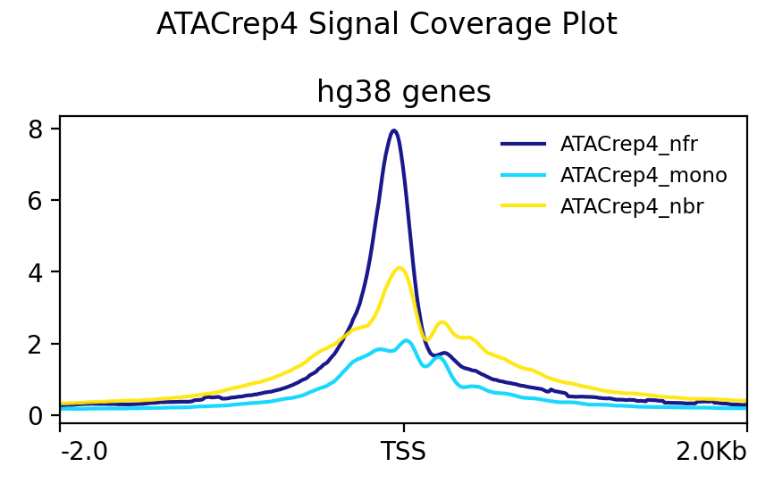
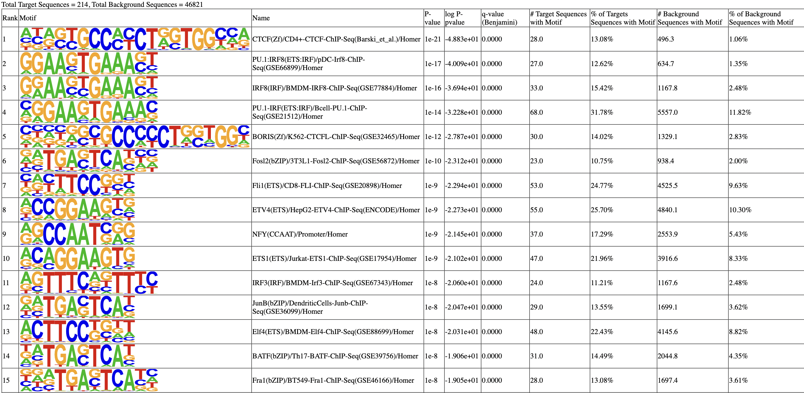

```{r setup, include=FALSE}
knitr::opts_chunk$set(echo = TRUE)
```
# Methods 

Overall methods were adapted from [The Cebola lab's ATAC-seq pipeline](https://github.com/CebolaLab/ATAC-seq){target="_blank"} as well as the publication, [*From reads to insight: a hitchhiker’s guide to ATAC-seq data analysis*](https://genomebiology.biomedcentral.com/articles/10.1186/s13059-020-1929-3){target="_blank"}.

The FASTQ files were inspected for quality control using FastQC v0.12.1-0 with default parameters (fastqc --threads 16 <atacseq.fastq> -o <out_directory>) (1).
Once QC checked, the reads were trimmed of adapters using Trimmomatic v0.39 in paired-end mode 
(trimmomatic PE -threads 16 <atacseq_r1.fastq> <atacseq_r2.fastq> <trim_paired_r1.fastq> <trim_unpaired_r1.fastq> <trim_paired_r2.fastq> <trim_unpaired_r2.fastq> ILLUMINACLIP:NexteraPE-PE.fa:2:30:10 LEADING:3 TRAILING:3 SLIDINGWINDOW:4:15) (2). 
Bowtie2 v2.5.3 was used to create an index of the entire human genome using the GENCODE hg38 primary assembly for use in alignment, with default parameters (bowtie2-build --threads <threads> GRCh38.primary_assembly.genome.fa.gz <index_basename>). Alignment was also performed using Bowtie2 v2.5.3 (3), and the alignment output was converted to BAM format using SAMtools v1.19.2 (4) (bowtie2 --threads <threads> --local --very-sensitive --no-mixed --no-discordant -I 25 -X 2000 -x <index_basename> -1 <atacseq_r1.fastq> -2 <atacseq_r2.fastq> | samtools view -bS - > <alignment.bam>). The alignment was sorted using SAMtools v1.19.2 (samtools sort <alignment.bam> -o <alignment_sorted.bam>) (4), and this file was used to perform alignment QC using SAMtools v1.19.2 flagstats (samtools flagstats <alignment_sorted.bam> > <flagstats.txt>) (4).

The alignment BAM files were filtered to remove alignments to mitochondrial genes, sorted, and indexed using SAMtools v1.19.2 (samtools view -h <alignment_sorted.bam> | grep -v chrM | samtools sort -O bam -o <rmchrM_sorted.bam>; samtools index <rmchrM_sorted.bam>) (4). Alignment quality control was subsequently performed on the filtered BAM files to ensure mitochondrial alignments were properly filtered (samtools flagstats <alignment_sorted.bam> <flagstats.txt>). All QC reports generated thus far (FastQC and flagstats) were concatenated using MultiQC v1.20 (multiqc <out_directory> -o <out_directory>) (5). Signal-artifact regions were filtered from the filtered BAM file using the ENCODE blacklist with BEDTools v2.31.1 (bedtools intersect -nonamecheck -v -abam <rmchrM_sorted.bam> -b hg38-blacklist.v2.bed <filtered.bam>) (10). This BAM file was sorted and indexed in a similar manner as previously performed. After this filtering, reads were shifted to account for tagmentation process bias using deepTools v3.5.4 alignmentSieve (6) with the GENCODE hg38 blacklist BED file (7) (alignmentSieve --numberOfProcessors max --ATACshift --blackListFileName hg38-blacklist.v2.bed --bam <filtered.bam.bai> -o <shift.bam>). The shifted BAM file was sorted and indexed as done previously.

The R package ATACseqQC was used to determine fragment distribution sizes for all samples using the fragSizeDist function (8). Peak calling was performed on each replicate using MACS3 callpeak (macs3 callpeak -f BAMPE -t <shift.bam> -g hs -n <basename> -B -q 0.01 --outdir <out_directory>) (9). Reproducible peaks were identified using BEDTools v2.31.1 intersect with the -f 0.50 -r flag to select peaks that have at least 50% overlap between replicates (bedtools intersect -a <rep1_summits.bed> -b <rep2_summits.bed> -f 0.50 -r > <reproducible_peaks.bed>) (10). Although filtered out of the alignment BAM file, signal-artifact regions were filtered from this BED file using the ENCODE blacklist with BEDTools v2.31.1 to ensure that no peaks fell in the ENCODE blacklist region (bedtools intersect -a <reproducible_peaks.bed> -b hg38-blacklist.v2.bed -v > <filtered_peaks.bed>) (10). 

The filtered peaks were annotated to their nearest genomic feature using HOMER v4.11 annotatepeaks with the GENCODE primary assembly GTF file (annotatePeaks.pl <filtered_peaks.bed> hg38 -gtf gencode.v45.primary_assembly.annotation.gtf > <annotated_peaks.txt>) (11). Functional enrichment of proximal genes to these peaks was performed using HOMER v4.11 annotatepeaks with the -go flag (annotatePeaks.pl <filtered_peaks.bed> hg38 -gtf gencode.v45.primary_assembly.annotation.gtf -go <out_directory>) (11). Adjusted p-values were calculated using the Benjamini-Hochberg method, and the 15 pathways with the lowest p-adjusted value were plotted. Motifs were identified using HOMER v4.11 findMotifsGenome with the GENCODE hg38 primary assembly FASTA file (findMotifsGenome.pl <filtered_peaks.bed> GRCh38.primary_assembly.genome.fa <motif_directory> -size 200 -mask) (11). deepTools bamCoverage was used to identify nucleosome-free, nucleosome-bound, and mononucleosome regions (bamCoverage -b {input.sorted_bam} -o {output.sorted_bigwig} --maxFragmentLength (bamCoverage -b <shift.bam> -o <nfr_bigWig> --maxFragmentLength 100), (bamCoverage -b <shift.bam> -o <mono_bigWig> --minFragmentLength 180 --maxFragmentLength 247), (bamCoverage -b <shift.bam> -o <nbr_bigWig> --minFragmentLength 248)) (6). These three BigWig files were used to compute the score matrix for each replicate using deepTools v3.5.4 computeMatrix with reference genomic coordinates for the entire genome extracted from the UCSC Table Browser (selections: Clade: Mammal, Genome: Human, assembly: hg38, group: Genes and Gene Predictions, track: NCBI RefSeq, table: UCSC Refseq, region: genome) (computeMatrix reference-point -S <nfr_bigWig> <mono_bigwig> <nbr_bigWig> -R hg38_genes.bed -b 2000 -a 2000 -o <score_matrix.gz>) (6). This score matrix was used to plot signal coverage for each replicate with deepTools v3.5.4 plotProfile with default parameters (plotProfile -m <score_matrix.gz> -o <plot.png>) (6).


# Results 
## Sequence QC

Sequence quality control was performed using FASTQC. No glaring sequence quality concerns were observed. While FASTQC flagged the sequence duplication levels as abnormal, the duplication level was <30%, which is acceptable for ATAC-seq samples. Additionally,the Per Base Sequence Content report was flagged as abnormal because of an over representation of C and T at the beginning of the reads. This pattern was present in each replicate and each read. This is likely due to the presence of the Nextera transposase adapter, and was trimmed in subsequent analysis. 

## Alignment QC

Alignment quality control was performed using Samtools flagstats. There were no major alignment quality issues that would call for the exclusion of a sample. Notably, there was a very high incidence of reads mapped to the mitochondrial genome. These reads were filtered out for subsequent analysis. 

### Alignment Statistics 

```{r, echo=FALSE}
data <- data.frame(
  Sample = c("ATACrep3", "ATACrep4"),
  pre_mito_filter_count = c(150.1,111.1),
  post_mito_filter_count = c(38.6,29.4),
  mito_alignments = c(111.5,81.7)
)

knitr::kable(data, col.names = c("Sample", "Before ChrM filteirng", "After ChrM filtering", "Mitochondrial Alignments"),caption = "Number of reads aligned before and after filtering out mitochondrial alignments. Counts are in millions.")


```

## Fragment Length Distribution Plots 

```{r echo=TRUE, message=FALSE, warning=FALSE}
library(ATACseqQC)

#define the filepaths for bam and index for each replicate
rep3_bamfile <- "ATACrep3_shifted_sort.bam"
rep3_index <- "ATACrep3_shifted_sort.bam.bai"

rep4_bamfile <- "ATACrep4_shifted_sort.bam"
rep4_index <- "ATACrep4_shifted_sort.bam.bai"

# calculate and plot fragment size distribution
rep3_plot <- fragSizeDist(rep3_bamfile, rep3_index)
rep4_plot <- fragSizeDist(rep4_bamfile, rep4_index)
```

## Peak Calling 

ATACrep3 had 30049 peaks and ATACrep4 had 26139 peaks. While many peaks were identified in the individual samples, only 214 were identified as reproducible. This was defined as having 50% similarity between ATACrep3 and ATACrep4. Since I filtered out the blacklisted regions after alignment, (in the bam file), no blacklisted regions were present in my peaks. I checked this by using samtools to filter out the blacklisted region peaks, and the number of peaks was the same before and after filtering. 
    
```{r echo=FALSE}
data <- data.frame(
  Sample = c("ATACrep3", "ATACrep4"),
  peak_count = c(30049,26139),
  reproducible_peaks = c(214,214)
)


# Print the table
knitr::kable(data, col.names = c("Sample", "Peak count", "Reproducible Peaks"))

```

## Signal Coverage 
Signal coverage plots for the nucleosome free regions (nfr), mononucleated regions (mono), and nucleosome-bound regions (nbr)

```{r echo=FALSE}


```

## Motif Finding  


```{r echo=FALSE}

```

## Gene Ontology 

```{r message=FALSE, warning=FALSE}
# Load required libraries
library(ggplot2)
library(tidyverse)
library(readr)

# read in homer gene ontology file 
go_list <- read_csv("gene_ont.csv")
#calculate p.adjusted 
go_filter <- go_list %>%
  mutate(p.adjust = p.adjust(p = `P-value`, method = "BH"))%>%
  dplyr::filter(p.adjust < 0.05)
#select top 15 pathways 
subset_go_list <- go_list %>%
  arrange(`P-value`) %>%   
  slice(1:15)%>%
  mutate(GeneRatio = `# of Target Genes in Term`/`# of Target Genes`)
#create dotplot
ggplot(data = subset_go_list, aes(x = GeneRatio, y = Term, color = `P-value`, size = `# of Target Genes in Term`)) + 
  geom_point()+
  scale_color_gradient(low = "red", high = "blue") +
  scale_x_continuous(labels = function(x) sprintf("%.2f", x), breaks = seq(0, 0.22, by = 0.1))  +
  theme_bw() +
  ylab("") +
  xlab("Gene Ratio") +
  ggtitle("GO enrichment for Peaks")+ 
  expand_limits(x = c(-0.01,.21))
```

## Peak Identity

```{r message=FALSE, warning=FALSE}
library(tidyverse)
library(ggplot2)
#read in annotated peaks file 
peaks <- read_delim("annotated_peaks.txt", delim = "\t", col_names = TRUE) 

#subset data based on annotation type and calculate proportions 
tts <- nrow(peaks[peaks$Annotation %in% grep("TTS", peaks$Annotation, value = TRUE), ])/nrow(peaks)
intron <- nrow(peaks[peaks$Annotation %in% grep("intron", peaks$Annotation, value = TRUE), ])/nrow(peaks)
promoter_tss <- nrow(peaks[peaks$Annotation %in% grep("promoter-TSS", peaks$Annotation, value = TRUE), ])/nrow(peaks)
intergenic <- nrow(peaks[peaks$Annotation %in% grep("Intergenic", peaks$Annotation, value = TRUE), ])/nrow(peaks)
exon <- nrow(peaks[peaks$Annotation %in% grep("exon", peaks$Annotation, value = TRUE), ])/nrow(peaks)

annotations <- c("TTS", "Intron", "Promoter-TSS", "Intergenic", "Exon")
proportions <- c(tts, intron, promoter_tss, intergenic, exon)
#create dataframe for plotting 
annotation_df <- data.frame(Annotation = annotations, Proportion = proportions)

#sort dataframe for better visualization
annotation_df <- annotation_df %>% arrange(desc(Proportion))

#labels for plot 
annotation_df$labels <- paste(round(annotation_df$Proportion * 100, 1), "%", sep = "")

#produce bar plot 
ggplot(annotation_df, aes(x = Annotation, y = Proportion, fill = Annotation)) +
  geom_bar(stat = "identity", fill = "#7dd7f0") +
  geom_text(aes(label = labels), vjust = 0, hjust = -0.15, size = 3.5) +  
  theme_minimal() +
  theme(axis.text.x = element_text(angle = 45, hjust = 1)) +  
  labs(x = "Region", y = "Proportion of peaks") +  
  coord_flip() +  
  guides(fill = FALSE) +  
  expand_limits(y = 0.45) 


```


# Discussion

The ATAC-seq experiments provide valuable insights into the chromatin accessibility landscape and transcriptional regulation. Chromatin accessibility reveals the regulatory landscape and transcriptional activity of cells. Open chromatin regions coincide with active loci, allowing regulatory proteins to modulate gene expression. Changes in accessibility indicate shifts in cellular transcriptional states, such as during development or in response to stimuli.

### Gene Enrichment Analysis

 The enrichment of terms related to "DNA endoreduplication", "neural precursor cell proliferation", and "retinal ganglion cell axon guidance" suggests that the accessible chromatin regions are associated with cell cycle regulation, neuronal development, and axon guidance processes.The enrichment of the GABBR1 gene, which encodes the gamma-aminobutyric acid type B receptor subunit 1, indicates the potential involvement of GABA signaling in the cells. GABA is a well-known inhibitory neurotransmitter, and its receptor GABBR1 plays a crucial role in various neurological processes, including synaptic transmission and neuronal excitability (12). Enrichment of genes associated with "naive vs. Th1 CD4+ T cell" and "pre- vs. day 7 post-influenza vaccine in B cells" suggests that the accessible chromatin regions may be linked to the modulation of immune cell differentiation and response to external stimuli, such as vaccination. It is important to note that the cells used in this experiment (Buenrostro et al.) (13) were CD4+ T cells so this enrichment may not be significant in terms of biological processes. 

### Transcription Factor Binding Motif Analysis

The transcription factor binding motif analysis provides insights into the key regulatory elements and transcriptional networks governing the observed chromatin accessibility patterns.The enrichment of motifs for transcription factors such as CTCF, PU.1, IRF8, and ETS family members (ETV4, Fli1, ETS1) suggests the involvement of these master regulators in shaping the chromatin landscape. CTCF is a well-established protein known to play a crucial role in chromatin organization and gene regulation (14). PU.1 and IRF8 are important hematopoietic transcription factors that regulate the development and function of various immune cell types (15).There was a high presence of motifs for AP-1 family transcription factors, including Fosl2, JunB, BATF, and Fra1. AP-1 transcription factors are known to be involved in diverse cellular processes, such as proliferation, differentiation, and stress response (16). The enrichment of the NFY motif, which binds to the CCAAT box, suggests the importance of this ubiquitous transcriptional regulator in the regulation of promoter-proximal regions within the accessible chromatin landscape (17).

# References 

1. Andrews, S. (2010). FastQC: a quality control tool for high throughput sequence data. Available online at: http://www.bioinformatics.babraham.ac.uk/projects/fastqc/ 
2. Bolger, A. M., Lohse, M., & Usadel, B. (2014). Trimmomatic: a flexible trimmer for Illumina sequence data. Bioinformatics (Oxford, England), 30(15), 2114–2120. https://doi.org/10.1093/bioinformatics/btu170
3. Langmead, B., & Salzberg, S. L. (2012). Fast gapped-read alignment with Bowtie 2. Nature methods, 9(4), 357–359. https://doi.org/10.1038/nmeth.1923
4. Li, H., Handsaker, B., Wysoker, A., Fennell, T., Ruan, J., Homer, N., Marth, G., Abecasis, G., Durbin, R., & 1000 Genome Project Data Processing Subgroup (2009). The Sequence Alignment/Map format and SAMtools. Bioinformatics (Oxford, England), 25(16), 2078–2079. https://doi.org/10.1093/bioinformatics/btp352
5. Ewels, P., Magnusson, M., Lundin, S., & Käller, M. (2016). MultiQC: summarize analysis results for multiple tools and samples in a single report. Bioinformatics (Oxford, England), 32(19), 3047–3048. https://doi.org/10.1093/bioinformatics/btw354
6. Fidel Ramírez, Friederike Dündar, Sarah Diehl, Björn A. Grüning, Thomas Manke, deepTools: a flexible platform for exploring deep-sequencing data, Nucleic Acids Research, Volume 42, Issue W1, 1 July 2014, Pages W187–W191, https://doi.org/10.1093/nar/gku365
7. Amemiya, H.M., Kundaje, A. & Boyle, A.P. The ENCODE Blacklist: Identification of Problematic Regions of the Genome. Sci Rep 9, 9354 (2019). https://doi.org/10.1038/s41598-019-45839-z
8. Ou, J., Liu, H., Yu, J. et al. ATACseqQC: a Bioconductor package for post-alignment quality assessment of ATAC-seq data. BMC Genomics 19, 169 (2018). https://doi.org/10.1186/s12864-018-4559-3
9. Zhang, Y., Liu, T., Meyer, C.A. et al. Model-based Analysis of ChIP-Seq (MACS). Genome Biol 9, R137 (2008). https://doi.org/10.1186/gb-2008-9-9-r137
10. Aaron R. Quinlan, Ira M. Hall, BEDTools: a flexible suite of utilities for comparing genomic features, Bioinformatics, Volume 26, Issue 6, March 2010, Pages 841–842, https://doi.org/10.1093/bioinformatics/btq033
11. Heinz S, Benner C, Spann N, Bertolino E et al. Simple Combinations of Lineage-Determining Transcription Factors Prime cis-Regulatory Elements Required for Macrophage and B Cell Identities. Mol Cell 2010 May 28;38(4):576-589. PMID: 20513432
12. National Center for Biotechnology Information (NCBI) (2024). GABBR1 gamma-aminobutyric acid type B receptor subunit 1 [ Homo sapiens (human) ]. https://www.ncbi.nlm.nih.gov/gene/2550[1]
13. Buenrostro, J., Giresi, P., Zaba, L. et al. Transposition of native chromatin for fast and sensitive epigenomic profiling of open chromatin, DNA-binding proteins and nucleosome position. Nat Methods 10, 1213–1218 (2013). https://doi.org/10.1038/nmeth.2688
14. Holwerda, S. J., & de Laat, W. (2013). CTCF: the protein, the binding partners, the binding sites and their chromatin loops. Philosophical transactions of the Royal Society of London. Series B, Biological sciences, 368(1620), 20120369. https://doi.org/10.1098/rstb.2012.0369
15. Li, G., Hao, W., & Hu, W. (2020). Transcription factor PU.1 and immune cell differentiation (Review). International Journal of Molecular Medicine, 46, 1943-1950. https://doi.org/10.3892/ijmm.2020.4763
16. Shetty, A., Tripathi, S. K., Junttila, S., Buchacher, T., Biradar, R., Bhosale, S. D., Envall, T., Laiho, A., Moulder, R., Rasool, O., Galande, S., Elo, L. L., & Lahesmaa, R. (2022). A systematic comparison of FOSL1, FOSL2 and BATF-mediated transcriptional regulation during early human Th17 differentiation. Nucleic acids research, 50(9), 4938–4958. https://doi.org/10.1093/nar/gkac256
17. Ly, L. L., Yoshida, H., & Yamaguchi, M. (2013). Nuclear transcription factor Y and its roles in cellular processes related to human disease. American journal of cancer research, 3(4), 339–346.

